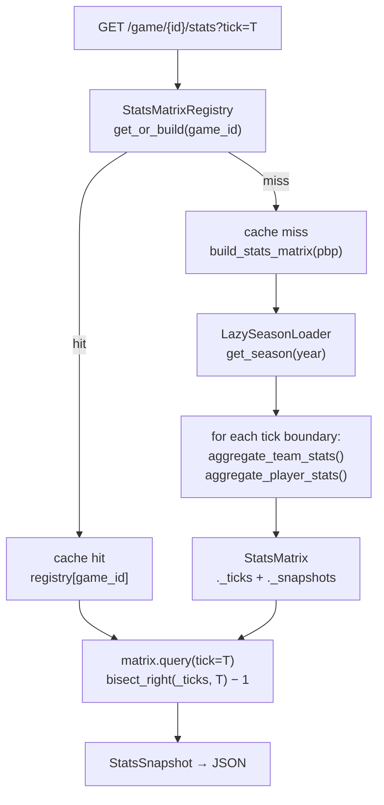
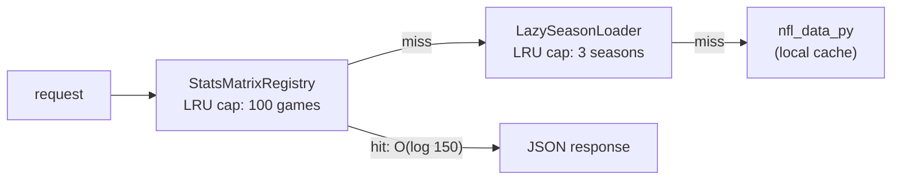

# paradox-stats

Temporally-gated NFL team and player statistics service. Returns cumulative box score stats at any elapsed second of any NFL game — no future-state bleed. Part of the [ParadoxSportsData](https://github.com/ParadoxSportsData) platform alongside [paradox-clock-gate](https://github.com/ParadoxSportsData/paradox-clock-gate) (game state engine) and [paradox-ui](https://github.com/ParadoxSportsData/paradox-ui) (React frontend).

**Port:** 8001  
**Language:** Python 3.12, FastAPI, uvicorn, pandas, nfl_data_py

---

## What It Does

A viewer scrubs a timeline slider to second T. paradox-stats answers: *"What does the box score look like at exactly second T?"* Only plays with `game_clock_total_seconds <= T` are included. Plays after T cannot appear in the response — this is the **temporal isolation guarantee**.

The implementation pre-computes cumulative stats at each play boundary (~150 per game) into a `StatsMatrix`. Queries binary-search the pre-built index — O(log 150) per request regardless of how many plays are in the game.

---

## Architecture

### Request and cache pipeline



### Two-Level LRU Cache



| Level | Class | Default | Eviction |
|---|---|---|---|
| Season pbp DataFrames | `LazySeasonLoader` | 3 seasons | LRU on `get_season(year)` |
| Game StatsMatrix objects | `StatsMatrixRegistry` | 100 games | LRU on `get_or_build(game_id)` |

`StatsMatrixRegistry` uses per-game `asyncio.Lock` with double-checked locking — concurrent requests for the same uncached game trigger exactly one build, not N redundant builds.

### Temporal Isolation

Every snapshot at tick T is built from plays where `game_clock_total_seconds <= T`. The filter is applied at `StatsMatrix.build()` time, not at query time. Querying a snapshot never re-reads play data — it returns a frozen aggregate.

---

## Startup Behavior

On startup the 2011 season is **eager-loaded**: all play-by-play data for the full 2011 season is loaded into `app.state.loader` and the `LazySeasonLoader` cache is warm. This means:

- First request for any 2011 game: ~1–3 seconds (StatsMatrix build from in-memory pbp)
- Subsequent requests for the same game: sub-millisecond (registry cache hit)
- First request for a non-2011 game: additional nfl_data_py download time + build

The `/games?season=N` endpoint triggers a background `asyncio.create_task` to warm the `StatsMatrixRegistry` for all games in the returned list — so browsing the game library pre-warms the cache before a game is selected.

---

## API Reference

### `GET /health`

```json
{
  "status": "ok",
  "service": "paradox-stats",
  "loaded_seasons": [2011],
  "cached_games": 4
}
```

### `GET /games?season=2011`

Returns a sorted list of `game_id` strings for the given season. Triggers background StatsMatrix prefetch for all returned games.

```
["2011_01_ATL_CHI", "2011_01_BUF_KC", ..., "2011_21_NYG_NE"]
```

Query param: `season` — integer, 2000–2030 (default: 2011). Returns 422 if out of range.

### `GET /game/{game_id}/stats?tick=N`

Returns cumulative stats for both teams and all active players at elapsed second `N`.

**Request:**
```
GET /game/2011_01_NO_GB/stats?tick=1800
```

**Response:**
```json
{
  "game_id": "2011_01_NO_GB",
  "tick": 1800,
  "home_team": "GB",
  "away_team": "NO",
  "team": {
    "home": {
      "pass_yards": 214,
      "completions": 17,
      "attempts": 26,
      "pass_tds": 2,
      "interceptions": 0,
      "rush_yards": 48,
      "carries": 14,
      "rush_tds": 1,
      "fumbles_lost": 0,
      "turnovers": 0,
      "sacks_allowed": 1,
      "sacks": 2,
      "first_downs": 14,
      "third_down_attempts": 8,
      "third_down_conversions": 5,
      "epa": 7.2
    },
    "away": { "...": "same shape" }
  },
  "players": {
    "home": {
      "qb": [
        {
          "player_id": "00-0023459",
          "name": "A.Rodgers",
          "pass_yards": 214,
          "completions": 17,
          "attempts": 26,
          "pass_tds": 2,
          "interceptions": 0,
          "passer_rating": 128.4,
          "sacks_taken": 1,
          "rush_yards": 8,
          "rush_attempts": 2
        }
      ],
      "rb": [ "{ carries, rush_yards, rush_tds, receptions, rec_yards, rec_tds }" ],
      "wr_te": [ "{ targets, receptions, rec_yards, rec_tds }" ],
      "k": [ "{ fg_made, fg_att, fg_long, xp_made, xp_att }" ]
    },
    "away": { "...": "same shape" }
  }
}
```

**Error responses:**
- `400` — `tick < 0`
- `404` — `game_id` not found or season data unavailable
- `422` — season param out of range (for `/games`)

---

## Scaling

### Concurrent Users

One `StatsMatrix` per game is shared across all requests. Ten thousand users watching the same game at the same tick each execute one binary search on the same in-memory list — no pandas re-aggregation, no per-user allocation.

The GC (garbage collector) has nothing to reclaim on the query path: `StatsMatrix` builds once at cache-miss time and is read-only thereafter. Query latency is dominated by network round-trip (20–100 ms), not the lookup (microseconds).

### How Many Games in Memory

One `StatsMatrix` ≈ 150 snapshots × (team stats + player dicts) ≈ 1–3 MB per game. Default LRU cap is 100 games ≈ 100–300 MB — comfortably within a single server's budget for games currently being watched.

### Horizontal Scaling

Each instance of paradox-stats is fully independent — no shared state, no coordination. A load balancer in front of N instances gives N × LRU capacity. Sticky sessions improve cache hit rate but are not required for correctness.

### Known Limitation: Cold Start

The first request per game triggers a full StatsMatrix build from the play-by-play DataFrame (~1–3 seconds). For a deployment serving thousands of distinct games, a pre-compilation step (serialize `StatsMatrix` to disk, memory-map at startup) would reduce cold start to milliseconds. The in-memory `StatsMatrix` layout is already amenable to this — it is not implemented today.

---

## Setup

```bash
git clone https://github.com/ParadoxSportsData/paradox-stats
cd paradox-stats
python3 -m venv .venv
source .venv/bin/activate
pip install -e ".[dev]"

# Start the service (port 8001)
uvicorn main:app --port 8001 --reload
```

The first startup downloads the 2011 season from nfl_data_py (cached locally by the library after first download). Subsequent startups use the local cache.

---

## Running Tests

```bash
source .venv/bin/activate
python -m pytest tests/ -v
```

Expected: 59 passed, 1 skipped. Test files:

| File | Covers |
|---|---|
| `test_stats_matrix.py` | StatsMatrix build, query, temporal isolation |
| `test_stats_registry.py` | LRU eviction, concurrent build prevention, cache clear |
| `test_lazy_loader.py` | LazySeasonLoader demand loading, LRU, cache identity |
| `test_main_health.py` | Health endpoint structure, eager 2011 load |
| `test_games_endpoint.py` | /games list, default season, range validation |
| `test_stats_endpoint.py` | /game/{id}/stats contract, 404, 400, player shape |
| `test_stats_integration.py` | Cold/warm cache identity, temporal monotonic, browse |
| `test_team_stats.py` | aggregate_team_stats unit tests |
| `test_player_stats.py` | aggregate_player_stats unit tests per position |
